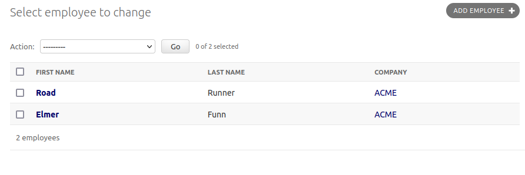

Usage
=====

Installation
------------

Install from `PyPI`_:

.. code-block:: bash

    $ pip install django-relatives

.. _PyPI: https://pypi.python.org/pypi/django-relatives/

.. _change_lists:

Linking to foreign keys in change lists
---------------------------------------

The easiest way to automatically to turn foreign key columns into hyperlinks in a Django admin change list is to inherit from :func:`RelativesAdmin <relatives.RelativesAdmin>` in your model admin.

.. code-block:: python

    from django.contrib import admin
    from relatives import RelativesAdmin

    from .models import Company, Employee

    @admin.register(Company)
    class CompanyAdmin(admin.ModelAdmin):
        list_display = ["name"]

    @admin.register(Employee)
    class EmployeeAdmin(RelativesAdmin):
        list_display = ["first_name", "last_name", "company"]

Screenshot
++++++++++

When viewing the change list for the employee model, you'll now see that the company column contents are all linked to the appropriate change form page for each company.

.. _change_forms:

Linking to foreign keys in change forms
---------------------------------------

The :func:`contents_or_fk_link <relatives.templatetags.relatives.contents_or_fk_link>` template filter can be used to link to foreign keys for readonly admin form fields.

Django Relatives also provides a replacement for the ``admin/includes/fieldset.html`` template which can be used to automatically link to all readonly foreign key fields in change forms.

To use the custom fieldset template you must add ``relatives`` to
``INSTALLED_APPS`` in your settings file:

.. code-block:: python

    INSTALLED_APPS = (
        ...
        'relatives',
    )

Next create a ``admin/includes/fieldset.html`` template file::

    

Also make sure this template file is in a custom template directory or an app
listed before your admin app in ``INSTALLED_APPS``.

Example Screenshot
~~~~~~~~~~~~~~~~~~

.. figure:: images/contents_or_fk_link_example.png

.. _reverse_relations:

Linking to reverse relations on change forms
--------------------------------------------

The :func:`related_objects <relatives.templatetags.relatives.related_objects>` template tag makes it easy to link to change lists
filtered for reverse relations (objects that have a foreign key to a given
object).

Django Relatives also provides a custom ``change_form.html`` template that may
be used to add a "Relations" sidebar to change forms.  This sidebar provides
links to change list queries for all objects that contain a foreign key to the
current object.

To use the custom fieldset template you must add ``relatives`` to
``INSTALLED_APPS`` in your settings file:

.. code-block:: python

    INSTALLED_APPS = (
        ...
        'relatives',
    )

Now you can customize the change form template for your desired models/apps.
The easiest way to link to reverse relations is to override the
``change_form_template`` in your ``ModelAdmin`` subclass.

Example
~~~~~~~

Code
++++

.. code-block:: python

    from django.contrib import admin

    from .models import Company, Employee

    class CompanyAdmin(admin.ModelAdmin):
        change_form_template = 'relatives/change_form.html'

    admin.site.register(Company, CompanyAdmin)

    admin.site.register(Employee)

Screenshot
++++++++++

.. figure:: images/related_objects_example.png

Linking to reverse relations with custom template
~~~~~~~~~~~~~~~~~~~~~~~~~~~~~~~~~~~~~~~~~~~~~~~~~

If you don't have access to change the ``ModelAdmin`` for your model or you are
already customizing your model's admin change form, you will need to use a
custom admin template instead.

Create a ``admin/YOURAPP/YOURMODEL/change_form.html`` template file that
extends from ``relatives/change_form.html``::

    

Also make sure this template file is in a custom template directory or an app
listed before your admin app in ``INSTALLED_APPS``.

.. _links_in_inlines:

Edit links in inlines
---------------------

To link to an inline object, include the :func:`object_link <relatives.utils.object_link>` utility function in your admin inline's ``fields`` list and ``readonly_fields`` list.

Example
~~~~~~~

Code
++++

.. code-block:: python

    from django.contrib import admin
    from relatives.utils import object_link

    from .models import Company, Employee

    class EmployeeInline(admin.TabularInline):
        model = Employee
        fields = [object_link, 'first_name', 'last_name']
        readonly_fields = fields
        extra = 0
        max_num = 0
        can_delete = False

    class CompanyAdmin(admin.ModelAdmin):
        inlines = [EmployeeInline]

    admin.site.register(Company, CompanyAdmin)

    admin.site.register(Employee)

Screenshot
++++++++++

.. figure:: images/object_link_example.png

Customizing inline edit links
-----------------------------

To customize the link text for your inline links, use the :func:`object_edit_link <relatives.utils.object_edit_link>` utility function instead, specifying the edit text and blank text (both are optional).

Example
~~~~~~~

Code
++++

.. code-block:: python

    from django.contrib import admin
    from relatives.utils import object_edit_link

    from .models import Company, Employee

    class EmployeeInline(admin.TabularInline):
        model = Employee
        edit_link = object_edit_link("Edit")
        fields = [edit_link, 'employee_id', 'first_name', 'last_name']
        readonly_fields = [edit_link]

    class CompanyAdmin(admin.ModelAdmin):
        inlines = [EmployeeInline]

    admin.site.register(Company, CompanyAdmin)

    admin.site.register(Employee)

Screenshot
++++++++++

.. figure:: images/object_edit_link_example.png

Customizing settings
--------------------

Since relatives uses cache, you can update the settings module to change the defaults if you'd like:

.. code-block:: python

    RELATIVES_CACHE_KEY = 'relatives_cache'
    RELATIVES_CACHE_TIME = int(60*60*24)
